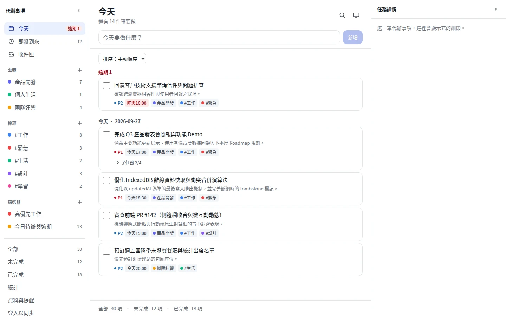
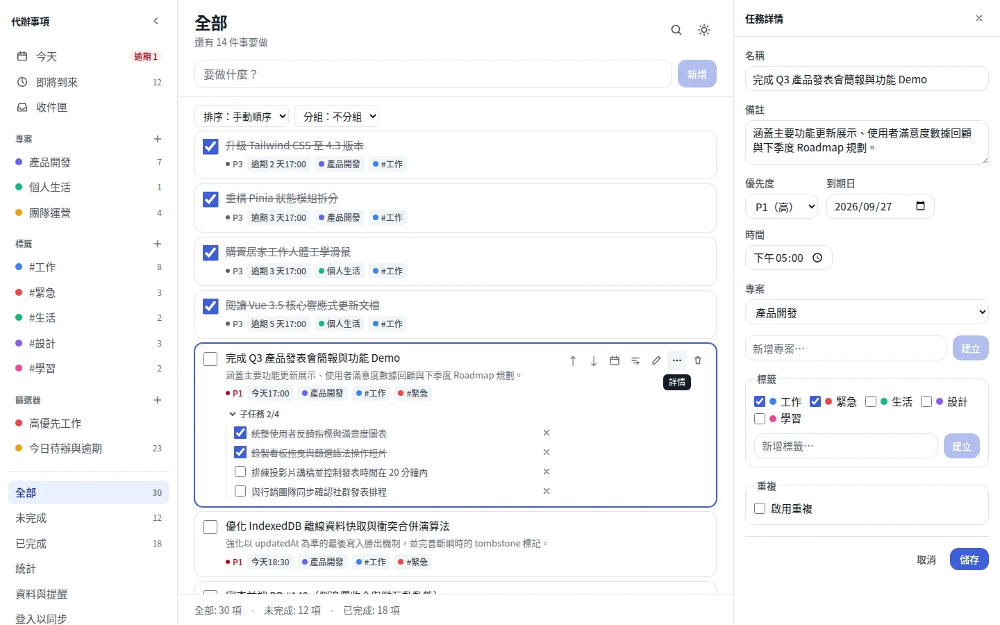
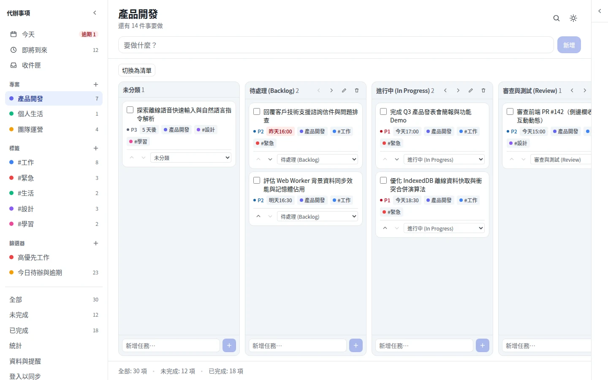
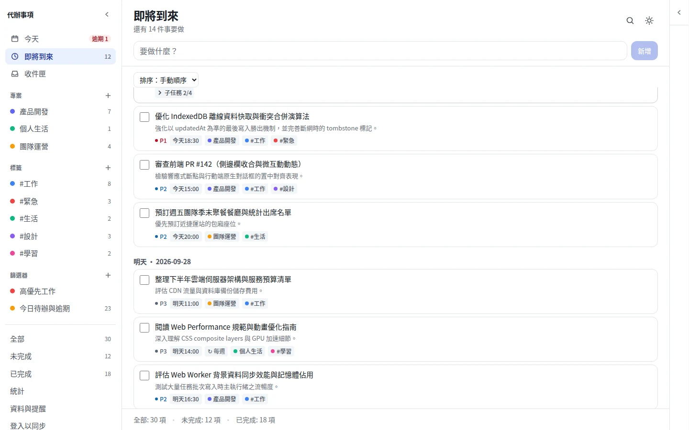
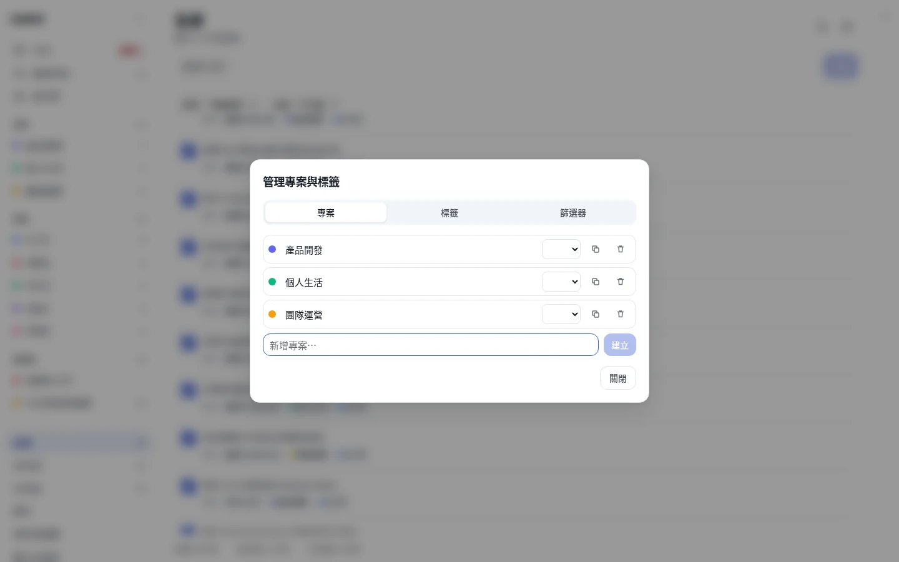
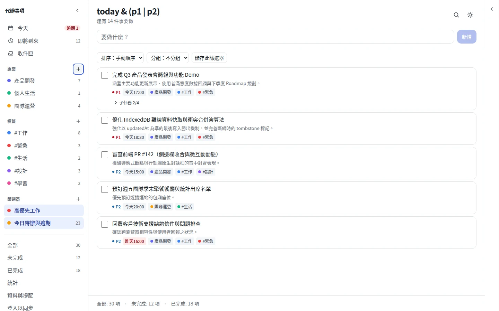
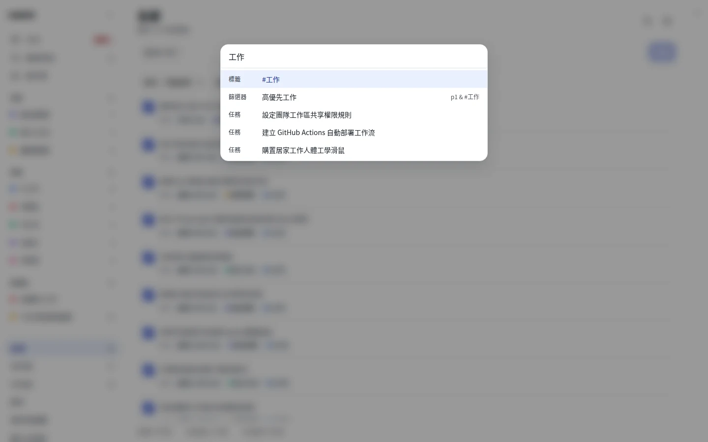
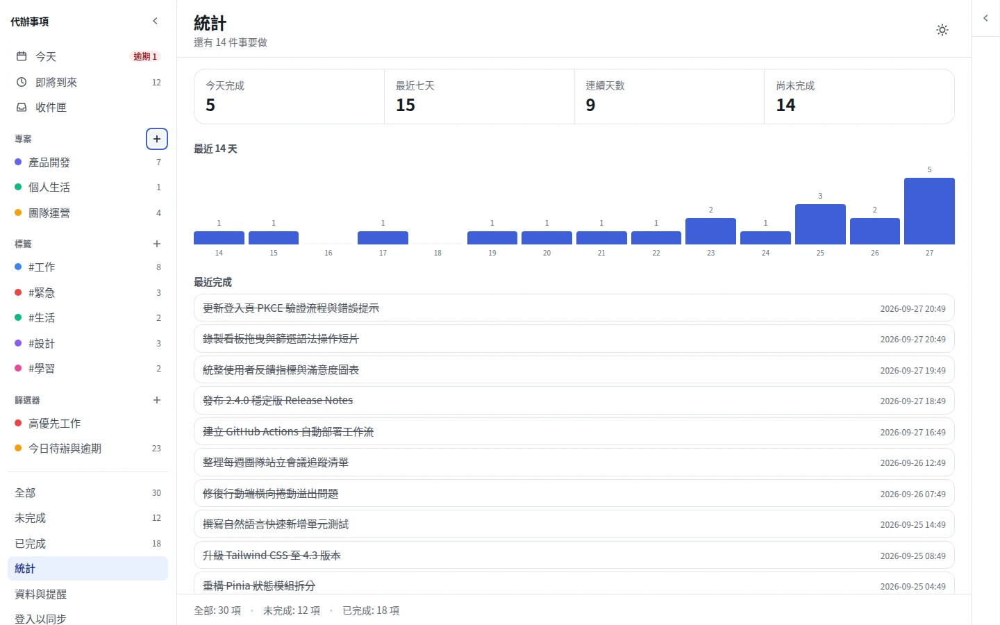

# Todo List

一個待辦事項工具：免安裝、免註冊，打開網頁就能用，資料存在你的瀏覽器裡，離線也能操作。需要在多台裝置間同步任務時，可以另外開啟登入功能。

[](https://github.com/lemoncat0817/todo-list/actions/workflows/ci.yml)
[](https://github.com/lemoncat0817/todo-list/actions/workflows/deploy.yml)

**線上版本：[lemoncat0817.github.io/todo-list](https://lemoncat0817.github.io/todo-list/)**

<picture>
  <source media="(prefers-color-scheme: dark)" srcset="./docs/screenshots/01-task-overview-dark.webp">
  
</picture>

## 畫面預覽

### 任務管理與詳細編輯

提供直覺流暢的待辦清單檢視，支援自然語言快速新增、P1–P4 優先度分級、到期時間與標籤標記；側邊詳情面板提供完整子任務樹、循環重複規則設定與即時編輯。

|                        待辦清單主畫面                        |                       任務詳情與子任務展開                       |
| :---: | :---: |
|    |    |

### 專案看板與多元檢視

專案內建卡片看板（Board View），依工作流程區段自由拖曳排程；提供「今天」、「即將到來」、「收件匣」等多元時間維度，智慧按日期群組掌控未來進度。

|                        專案卡片看板檢視                         |                        時間維度與即將到來檢視                         |
| :---: | :---: |
|        |     |

### 專案管理與進階篩選

集中管理專案與標籤階層，支援色彩自訂與快速切換；內建強大的篩選器查詢語言（Filter Query Language），支援 `&`、`|`、`!` 等邏輯運算子與精準條件組合。

|                      專案、標籤與色彩管理                       |                   自訂進階篩選查詢（Filter Query）                    |
| :---: | :---: |
|  |           |

### 快捷操作與生產力統計

全域命令面板（`Cmd`/`Ctrl`+`K`）支援模糊搜尋指令、快速跳轉檢視與任務搜尋；生產力統計儀表板視覺化呈現完成率、連續完成天數與 14 天趨勢長條圖。

|                     全域命令面板（Cmd+K）                      |                        任務完成數據與回顧統計                         |
| :---: | :---: |
|      |  |

## 功能

- **任務管理**：新增／編輯／刪除／完成，優先度、備註、到期日、專案分類、標籤、子任務、拖曳排序、多選批次操作
- **快速新增**：一行文字解析日期、時間、優先度、專案、標籤與重複規則

  ```
  明天下午3點 交季報 p1 #工作 @公司
  ```

- **重複性任務**：每日／每週／每月，可設間隔與結束條件
- **檢視與篩選**：今天／即將到來／收件匣／專案／標籤，以及篩選器查詢語言

  ```
  today & p1 & #工作
  (overdue | today) & !@等待中
  ```

- **鍵盤操作與命令面板**（`Cmd`/`Ctrl`+`K`）、完整復原（`Cmd`/`Ctrl`+`Z`）
- **離線與資料**：PWA 離線使用、JSON 匯出／匯入、到期提醒、完成統計頁
- **跨裝置同步與協作**（選配，見下方設定）：Google／GitHub 登入、共享專案、任務指派、留言、通知

## 技術棧

| 套件 | 版本 | 備註 |
| --- | --- | --- |
| Vue | 3.5.41 | Composition API only |
| Pinia | 4.0.3 | |
| Vue Router | 5.2.0 | hash 模式 |
| Vite | 8.2.1 | |
| TypeScript | ~6.0.3 | |
| Tailwind CSS | 4.3.3 | |
| idb | 8.0.3 | IndexedDB 封裝 |
| Vitest / Playwright | 4.1.10 / 1.62.1 | 單元測試 / E2E |
| @supabase/auth-js、realtime-js | 2.112.4 | 認證與即時協作，動態載入 |

## 開發

需要 Node `^20.19.0 || >=22.12.0` 與 pnpm。

```sh
pnpm install
pnpm dev          # 開發伺服器
pnpm build        # 生產建置
pnpm preview      # 預覽建置產物

pnpm typecheck    # vue-tsc
pnpm lint         # ESLint
pnpm test         # Vitest 單元測試
pnpm test:e2e     # Playwright E2E（含無障礙檢測）
```

### 選配：接上跨裝置同步

不做這一段，`pnpm dev` 就是完整可用的純本地版本。

1. 到 https://supabase.com/dashboard 建一個免費專案
2. 套用資料庫遷移：安裝 Supabase CLI 並連結專案後執行 `npx supabase db push`，
   或到 Dashboard 的 SQL Editor 依序手動貼上 [`supabase/migrations/`](supabase/migrations) 底下每個檔案
3. Project Settings → API，把 `Project URL` 和 `anon public` key 填進複製自
   [`.env.local.example`](.env.local.example) 的 `.env.local`
4. 啟用 Google／GitHub 登入（見下方）
5. `pnpm dev`，側邊欄會出現「登入以同步」
6. （選配）若需推播通知、每日摘要信與工作區邀請信，部署雲端函式：
   ```sh
   npx supabase functions deploy send-task-notification --no-verify-jwt
   npx supabase functions deploy send-daily-digest --no-verify-jwt
   npx supabase functions deploy send-invitation-email
   ```

### 啟用 Google／GitHub 登入

1. 到對應供應商的開發者主控台建立 OAuth App，Redirect URI 統一填
   `https://<your-project-ref>.supabase.co/auth/v1/callback`：
   - Google：[Google Cloud Console](https://console.cloud.google.com/apis/credentials) → 建立 OAuth 用戶端 ID（類型選「網頁應用程式」）
   - GitHub:Settings → Developer settings → OAuth Apps → New OAuth App
2. 把 Client ID／Client Secret 貼進 Supabase Dashboard 的 **Authentication → Providers**，打開 Google／GitHub
3. Google 同意畫面預設是 **Testing** 狀態,只有測試名單裡的信箱能登入；要開放給所有人，改成 **In production**
   （使用者登入時仍會看到一次「未驗證應用程式」警告，屬 Google 預設行為）
4. **Authentication → URL Configuration** 把本機與正式站網址加進 **Redirect URLs**
